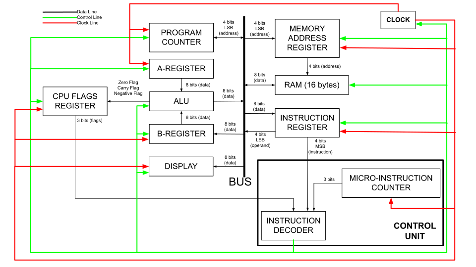

# 8-bit CPU
This project is a demonstration of how a barebones, but turing complete, 8-bit CPU works at the logic gate/register level, demonstrated using [Logisim](https://github.com/logisim-evolution/logisim-evolution). This project was motivated by [Ben Eater](https://www.youtube.com/@BenEater) and the [video series](https://www.youtube.com/playlist?list=PLowKtXNTBypGqImE405J2565dvjafglHU) produced by him where he builds an 8-bit CPU on breadboards.

Logisim files for this project could be found [here](./logisim-files/).

## Architecture

This design follows a single data/address bus scheme. All peripherals (registers, counters, RAM etc.) share data amongst themselves using this common bus. The control unit co-ordinates the data sharing between these peripherals.

The CPU is made up of the following components:
#### 1. System Bus
This is the common conduit for data sharing between peripherals. The bus is 8-bit wide and transmits instructions, address and data. While this is not optimal and restricts the size of address space and the size of the instructions, it is a good enough solution for the application at hand: demonstrating computer architecture.

#### 2. A-Register
This is the primary register of the computer and in which data could be stored or from which data could be obtained  by the user using the supplied instructions.

#### 3. B-Register
This is the secondary register of the computer which is used by the CPU to store temporary/intermediate data and cannot be accessed by the user using the supplied instructions to load data from or store data into.

#### 4. ALU (adder and subtractor)
The ALU for this computer consists of only an 8-bit adder which is wired in way that it could also do subtraction using 2's-complement addition. The A and B registers connect directly to the ALU, which continuously sums(or subtracts) the contents of these registers. User cannot access the data stored in the ALU directly but could access it via the A-Register using the supplied instructions.

#### 5. CPU Flags register
This is a 3-bit wide register and is what makes the CPU *Turing Complete*. Without this, the CPU cannot have the conditional jump ability, which in turn renders the computer Turing *In*complete. This is hooked to the ALU and indicates if the current arithmetic operation resulted in a zero result or a result with a carry or a negative result (MSB set). These flags are used by the conditional jump instructions to alter the execution path accordingly and constitute a closed-loop system with feedback.

#### 6. Program Counter
This is a 4-bit binary counter and it counts from 0 to 15 which supplies the memory address of the current instruction to be executed by the computer. User can manipulate the program count using the supplied jump/conditional jump instructions.

#### 7. Memory Address Register
This is a 4-bit register connected directly to the main memory(RAM) and which supplies the RAM with the memory address from which data is to be read or into which data is to be written in the next clock cycle. User can load data from or store data into any location within the RAM using the supplied instructions.

#### 8. RAM
Being the main memory of the CPU, it stores the program code and the program data. The RAM for this computer is 16 bytes in size, which I do agree is *very* limited, but more than sufficient for the purpose at hand: demonstrating the working of a computer.

#### 9. Instruction Register
This is an 8-bit register which stores the current instruction under exection. The four MSB bits encode the instruction itself and the remaining bits is the operand for the instruction. This register takes in 8 bits of data from the bus and relays back only the four LSB (operand) back to the bus. The four MSB bits goes to the instruction decoder.

#### 10. Control Unit
As the name suggests, this is what controls and coordinates actions between all peripherals of the CPU. The control unit acts as the bus master and dictates which peripheral spits data out onto the bus and which peripherals consume data from the bus as required by the instruction currently under execution. The control unit is comprised of two elements:
1. Micro-Instruction Counter : Each instruction for this CPU is comprised of a series of micro-instructions, each of which is executed per clock cycle. This counter keeps track of micro-instruction under execution.
2. Instruction Decoder : This is an EEPROM which takes in data from the flags register, instruction register and the micro-instruction counter and maps this data in to what is called as a *Contol Word*, which is 16-bits long. Each bit of this control word controls a peripheral in a certain way that enables the control unit to do its job.

#### 11. Display Unit
This is an array of four seven-segment display which is connected to the bus and can render the binary data in the bus into the human-readable decimal form. The display can operate in two modes:
1. Normal Mode : Renders the 8-bit data in the bus into an unsigned decimal number. Can display numbers from 0 to 255.
2. 2's Complement Mode : Renders the 8-bit data in the bus into a signed decimal number. Can display numbers from -128 to +127.

#### 12. System Clock Module
This produces the clock signal to synchronize the circuit's operation and could be operated in two modes:
1. Automatic : The oscillator is connected to the system clock line.
2. Manual : A manual switch is connected to the system clock line. This comes in handy to carefully observe each micro-instruction under exectution and for debugging purposes.

User can stop this module from outputting clock signal using the supplied halt instruction.

## How do the instructions work?
Each instruction for this computer is an 8-bit wide binary number. The four MSB of this number is the instruction number and the remaining four bits is the operand, which could be data or a RAM address. Not all instructions require an operand. The computer starts reading program from address 0 of the RAM and therefore the program must start at address 0.

Program execution starts with the fetch cycle, comprising of two steps and then followed by the execution of the actual instruction:
1. *Fetch*: The contents of the program counter are thrown out onto the bus and is picked up by the memory address register. This happens in the first clock cycle of fetch routine. 
2. *Fetch*: In the next clock cycle, the contents of the RAM, at the address given by the memory address register, is thrown onto the bus which is picked by the instruction register and the program counter is incremented by one count. Now we have the instruction in our instruction register and that is the end of the fetch routine.
3. *Execute*: In the next clock cycle, the instruction's operand is thrown onto the bus and is picked by the relevant peripheral. This happens only if the instruction has an operand. Otherwise someother course of action ensues, depending on the instruction. Example: for the instruction **LDI**, the Load Immediate instruction which loads a 4-bit value into the A-register, the operand is put on the bus which is picked by the A-Register and that is the end of the LDI instruction. Similarly, for the instruction **HLT**, the Clock Halt instruction, which takes no operand, the clock halt line is enabled and that is the end of the HLT instruction.
4. *Execute*: The exection will go on for clock cycle four and five, thereby making every instruction five cycles long. Not all instructions need five cycles: the shortest of them complete in three cycles and do nothing in the fourth and fifth cycle. The longest of them use up all five cycles. The shorter ones haven't been optimzed because optimisation is not the intent of this project.

Actions like the program counter outputting its value onto the bus, the instruction register picking up a value from the bus etc. are co-ordinated by the control unit, which has an instruction decoder EEPROM that has been programmed to output certain bit petterns which activate peripheral control lines depending on the instruction under execution, the sub-step of that instruction (the five steps above) and the CPU flags(if we're executing conditional jumps). The sub-step is tracked by the micro-instruction counter of the control unit.

Here's a complete walkthrough of how the LDA instruction works. LDA (instruction no. 2) takes an operand - it reads the value stored in the RAM address given by the operand and loads it into the A-Register. Here's how the micro-instruction works for LDA 12 (machine code: 0010 1100, load the contents of RAM at address 12 into the A-Register). The RAM has been programmed with LDA 12 (0010 1100) in address 0000 (only one instruction) and 0011 0101 (decimal 53) in address 1100(decimal 12).
1. The instruction decoder (ID) makes the program counter output the address(0000) onto the bus and the memory address register(MAR) read the bus.
2. The ID makes the RAM output the contents in that address(0010 1100) to bus and the instruction register read the bus. We now have LDA 12 in the instrction register (0010 1100).
3. The ID makes the instruction register output the operand (last 4 bits, 1100) to the bus and the MAR read the bus.
4. The ID makes the RAM output the contents(0011 0101, decimal 53) at the address given by MAR to the bus and the A-Register read the bus.

We now have the contents of the RAM at address 12 showing up in the A-Register. 

## Schematic

*I agree that this is not the most aesthetically pleasing diagram. With a decent amount of persistence, this circuit could be read and understood.*

## Instructions List
This computer design has 12 instructions that could load values into registers, store values to RAM, add and subtract numbers, halt the computer altogether and make conditional and unconditional jumps. The instruction format is as follows: `xxxx yyyy`. `xxxx` is the instruction number and `yyyy` is the operand (which may or may not matter depending on the instruction).

#### 1. LDI
**Instruction Number**: 1 (0001) <br>
**Operand**: Required <br>
**Machine Code**: `0001 xxxx`. `xxxx` is the value which is to be loaded into the A-Register. <br>
**Function**: Loads the value given by the *operand* into A-Register. <br>

#### 2. LDA
**Instruction Number**: 2 (0010) <br>
**Operand**: Required <br>
**Machine Code**: `0010 xxxx`. `xxxx` is the RAM address from which the value is loaded into the A-Register. <br>
**Function**: Loads the value at the RAM address given by the *operand* into A-Register. <br>

#### 3. STA
**Instruction Number**: 3 (0011) <br>
**Operand**: Required <br>
**Machine Code**: `0011 xxxx`. `xxxx` is the RAM address into which the value is in the A-Register is stored. <br>
**Function**: Stores value in the A-Register in the RAM address given by the *operand*. <br>

#### 4. ADD
**Instruction Number**: 4 (0100) <br>
**Operand**: Required <br>
**Machine Code**: `0100 xxxx`. `xxxx` is the RAM address, the value at which is added with the value in the A-Register. <br>
**Function**: Adds the value in the RAM address given by the *operand* into the value in the A-Register and stores the sum in the A-Register. This updates the carry flag, negative flag and the zero flag of the CPU Flags Register.<br>

#### 5. SUB
**Instruction Number**: 5 (0101) <br>
**Operand**: Required <br>
**Machine Code**: `0101 xxxx`. `xxxx` is the RAM address, the value at which is subtracted from the value in the A-Register. <br>
**Function**: Subtracts the value in the RAM address given by the *operand* from the value in the A-Register and stores the difference in the A-Register. This updates the carry flag, negative flag and the zero flag of the CPU Flags Register.<br>

#### 6. HLT
**Instruction Number**: 6 (0110) <br>
**Operand**: Don't Care <br>
**Machine Code**: `0110 xxxx`. `xxxx` could be any value and is ignored. <br>
**Function**: Halts the computer's clock module and therefore halts the program execution on the computer. <br> 

#### 7. JMP
**Instruction Number**: 7 (0111) <br>
**Operand**: Required <br>
**Machine Code**: `0111 xxxx`. `xxxx` is the RAM address to which the program execution of the next instruction is redirected to. <br>
**Function**: This is an unconditional jump instruction which sets the program counter value with the value given by the *operand* and thereby makes the program jump to the user given location in the next instruction cycle. <br> 

#### 8. NOP
**Instruction Number**: 8 (1000) <br>
**Operand**: Don't Care <br>
**Machine Code**: `1000 xxxx`. `xxxx` could be any value and is ignored. <br>
**Function**: This does nothing aka just makes the machine idle. 

#### 9. JC
**Instruction Number**: 9 (1001) <br>
**Operand**: Required <br>
**Machine Code**: `1001 xxxx`. `xxxx` is the RAM address to which the program execution of the next instruction is redirected to. <br>
**Function**: This is an conditional jump instruction which sets the program counter value with the value given by the *operand* and thereby makes the program jump to the user given location in the next instruction cycle, if the carry flag was set by the previous arithmetic operation. <br> 

#### 10. JZ
**Instruction Number**: 10 (1010) <br>
**Operand**: Required <br>
**Machine Code**: `1010 xxxx`. `xxxx` is the RAM address to which the program execution of the next instruction is redirected to. <br>
**Function**: This is an conditional jump instruction which sets the program counter value with the value given by the *operand* and thereby makes the program jump to the user given location in the next instruction cycle, if the zero flag was set by the previous arithmetic operation. <br>

#### 11. JN
**Instruction Number**: 11 (1011) <br>
**Operand**: Required <br>
**Machine Code**: `1011 xxxx`. `xxxx` is the RAM address to which the program execution of the next instruction is redirected to. <br>
**Function**: This is an conditional jump instruction which sets the program counter value with the value given by the *operand* and thereby makes the program jump to the user given location in the next instruction cycle, if the negative flag was set by the previous arithmetic operation. <br> 

#### 12. OUT
**Instruction Number**: 12 (1100) <br>
**Operand**: Don't Care <br>
**Machine Code**: `1100 xxxx`. `xxxx` could be any value and is ignored. <br>
**Function**: Renders the binary value in the A-Register as a decimal number on the seven-segment display.

## How to use this?
1. Install Logisim on your computer. 
2. Open the file `logisim-files/8-BIT-CPU.circ` in Logisim.
3. Enable simulation (Simulation->Simulation Enabled).
4. Choose tick frequency (Simulation->Tick Frequency).
5. Enable ticking (Simulation->Ticks Enabled).
4. Set the computer to manual clock mode with clock pulse low (so that the computer doesn't start running right away).
4. Reset the computer using the reset line (pulse the reset line once).
3. In the RAM, starting at address 0, program the machine code of the instruction you want to execute.
5. Set the computer to auto clock mode and let it rip. If you want to single-step the computer, set the clock to manual mode and pulse the clock manually.

## Sample Programs

#### 1. Counter
Program to count from 1, non-stop, while displaying on the SSD.
```
0 LDI 1     	//load the value 1 into A-Register.
1 STA 15    	//Store A-Register's contents in memory location 15.
2 LDI 0		//load the value 0 into A-Register.
3 ADD 15    	//Add the contents of mem. loc. 15 into A-Register.
4 OUT       	//Display contents of A-Register on SSD.
5 JMP 3     	//Jump to mem. loc. 2.
```

| RAM Address | Machine Code |
| --- | --- |
| 0000 | 0001 0001 (0x11) |
| 0001 | 0011 1111 (0x3f) |
| 0010 | 0001 0000 (0x10) |
| 0011 | 0100 1111 (0x4f) |
| 0100 | 1100 0000 (0xc0) |
| 0101 | 0111 0010 (0x73) |

#### 2. Count to Value
Program to count from 1, till a value stored in RAM, while displaying on the SSD.
```
0  LDI 1     	//load the value 1 into A-Register.
1  SUB 15    	//Subtract A-Register's contents in memory location 15.
2  JZ  8	//Jump to address 8 if the previous result was a zero.
3  ADD 15	//Add back contents of RAM at mem. loc. 15 to A-Register.
4  OUT		//Output A-Register contents on SSD.
5  ADD 14	//Add contents of mem. loc. 14 to A-Register.
6  JMP 1	//Jump to mem. loc. 1.
7  ADD 15	//Add back contents of RAM at mem. loc. 15 to A-Register.
8  OUT		//Output A-Register contents on SSD.
9  HLT		//Halt the computer.
.
.
.
14 1		//Value to increment count by.
15 57		//Value to stop at.
```

| RAM Address | Machine Code |
| --- | --- |
| 0000 | 0001 0001 (0x10) |
| 0001 | 0101 1111 (0x5f) |
| 0010 | 1010 1000 (0xa7) |
| 0011 | 0100 1111 (0x4f) |
| 0100 | 1100 0000 (0xc0) |
| 0101 | 0100 1110 (0x4e) |
| 0110 | 0111 0001 (0x71) |
| 0111 | 0100 1111 (0x4f) |
| 1000 | 1100 0000 (0xc0) |
| 1001 | 0110 0000 (0x60) |

| RAM Address | Data |
| --- | --- |
| 1110 | 0000 0001 (0x01) |
| 1111 | 0011 1001 (0x39) |
